# 🚀 AI-Powered Web Application Generator (Distributed Cloud Architecture)

[](https://openjdk.org/)
[](https://spring.io/projects/spring-boot)
[](https://spring.io/projects/spring-cloud)
[](https://spring.io/projects/spring-ai)
[](https://kafka.apache.org/)
[](https://kubernetes.io/)
[](https://redis.io/)
[](https://min.io/)
[](https://opensource.org/licenses/MIT)

> An enterprise-grade, distributed AI web application generator inspired by Lovable/v0. Architected as a microservices ecosystem with **Spring AI**, **Kafka-orchestrated Saga workflows**, **Kubernetes-native dynamic sandbox execution**, **Redis wildcard reverse proxies**, and **MinIO S3 storage**.

---

## 🌟 Architectural Highlights

* **Event-Driven AI Orchestration (Saga Pattern)**: Asynchronous coordination between LLM code generation and file tree persistence using Apache Kafka to prevent blocking and ensure eventual consistency.
* **On-Demand Kubernetes Sandbox Sandboxing**: Direct cluster orchestration using the Fabric8 Kubernetes Java SDK to dynamically spin up isolated, ephemeral preview containers with automated network policies.
* **High-Throughput Wildcard Subdomain Proxy**: Custom Node.js + Redis reverse proxy dynamically routing HTTP and WebSocket traffic for arbitrary preview subdomains (`*.previews.localhost`) to isolated Kubernetes sandbox pods.
* **Spring AI Multi-File Code Synthesis**: Streaming LLM generation engine with structured function-calling tools (`CodeGenerationTools`), prompt engineering context advisors, and real-time Server-Sent Events (SSE).
* **Enterprise Identity & Multi-Tenancy**: Granular Role-Based Access Control (RBAC), JWT authentication filters, multi-tenant workspace isolation, and automated Stripe subscription billing webhooks.
* **Centralized Configuration & Service Mesh**: Netflix Eureka service registry and Spring Cloud Config Server backed by Git for cloud-native dynamic configuration management.

---

## 📐 System Architecture

```mermaid
flowchart TD
    Client(["💻 User Browser / Client"])

    subgraph Edge ["🌐 Edge & Gateway Layer"]
        Ingress["Kubernetes Ingress-NGINX"]
        Gateway["API Gateway (Spring Cloud WebFlux :8080)"]
        Proxy["Wildcard Proxy (Node.js + Redis :80)"]
    end

    subgraph ServiceMesh ["⚙️ Cloud Microservices Mesh"]
        Eureka["Eureka Discovery Service (:8761)"]
        ConfigServer["Spring Cloud Config Server (:8888)"]
        AccountSvc["Account Service (:9050)<br/>• Auth & JWT<br/>• Stripe Subscriptions"]
        IntelSvc["Intelligence Service (:9030)<br/>• Spring AI Engine<br/>• LLM Streaming & Tools"]
        WorkspaceSvc["Workspace Service (:9020)<br/>• File Trees<br/>• K8s Pod Controller"]
    end

    subgraph AsyncBus ["⚡ Distributed Event Bus"]
        Kafka["Apache Kafka<br/>• file-store-requests<br/>• file-store-responses"]
    end

    subgraph StatefulInfra ["💾 Stateful Data Layer"]
        Postgres[("PostgreSQL Cluster<br/>(account, workspace, intelligence)")]
        Redis[("Redis Route Cache")]
        MinIO[("MinIO S3 Object Store")]
    end

    subgraph Sandboxes ["📦 Ephemeral Previews Namespace"]
        Pod1["Preview Pod #1 (:5173)"]
        Pod2["Preview Pod #2 (:5173)"]
    end

    %% Client Routing
    Client --> Ingress
    Ingress -->|"api.localhost/*"| Gateway
    Ingress -->|"*.previews.localhost/*"| Proxy
    
    %% Gateway to Services
    Gateway --> AccountSvc
    Gateway --> WorkspaceSvc
    Gateway --> IntelSvc

    %% Service Discovery & Config
    ServiceMesh -.-> Eureka
    ServiceMesh -.-> ConfigServer

    %% Kafka Saga
    IntelSvc -->|"Produces Code Event"| Kafka
    Kafka -->|"Consumes & Writes MinIO"| WorkspaceSvc
    WorkspaceSvc -->|"Saga Ack"| Kafka
    Kafka -->|"Acks Generation"| IntelSvc

    %% Storage & Cache Connections
    AccountSvc --> Postgres
    WorkspaceSvc --> Postgres
    WorkspaceSvc --> MinIO
    IntelSvc --> Postgres
    Proxy --> Redis
    WorkspaceSvc -->|"Registers Subdomain Routes"| Redis

    %% Dynamic Pod Spawning
    WorkspaceSvc ==>|"Fabric8 K8s SDK Deploy"| Pod1
    WorkspaceSvc ==>|"Fabric8 K8s SDK Deploy"| Pod2
    Proxy -.->|"Dynamic Reverse Proxy"| Pod1
    Proxy -.->|"Dynamic Reverse Proxy"| Pod2
```



---

## 🛠️ Microservices Ecosystem

| Microservice | Port | Description | Tech Stack |
| :--- | :---: | :--- | :--- |
| **`api-gateway`** | `8080` | Non-blocking reactive gateway handling CORS, SSL termination, rate limiting, and JWT validation filters. | Spring Cloud Gateway, WebFlux, JJWT |
| **`intelligence-service`** | `9030` | Core AI engine executing prompt synthesis, multi-file code generation, token usage metering, and Kafka saga events. | Spring AI, Kafka, OpenRouter / OpenAI, PostgreSQL |
| **`workspace-service`** | `9020` | Project lifecycle manager, file tree operations, MinIO S3 object persistence, and Fabric8 Kubernetes Pod controller. | Fabric8 K8s Client, MinIO SDK, Kafka, PostgreSQL |
| **`account-service`** | `9050` | Authentication, user principals, role authorization, Stripe checkout sessions, and webhook processing. | Spring Security, Stripe Java SDK, PostgreSQL |
| **`config-service`** | `8888` | Centralized externalized configuration server backed by Git repository versioning. | Spring Cloud Config Server |
| **`discovery-service`** | `8761` | Microservice service registry and dynamic health-aware load balancing. | Netflix Eureka Server |
| **`common-lib`** | `N/A` | Shared auto-configuration library with unified DTOs, security filters, custom exceptions, and Kafka saga events. | Spring Boot Starter, Lombok, MapStruct |
| **`proxy`** | `80` | Ultra-fast Node.js reverse proxy resolving Redis domain keys to dynamically route WebSocket/HTTP traffic to preview sandboxes. | Node.js, `http-proxy`, `ioredis` |

---

## 💡 Key Engineering Problems & Solutions

### 1. Non-Blocking AI Code Generation via Distributed Saga
* **Problem**: Generating complex multi-file full-stack applications via LLMs takes significant time; synchronous HTTP connections would timeout and lock server threads.
* **Solution**: Implemented an asynchronous **Choreography-based Saga pattern** over **Apache Kafka**. `intelligence-service` streams prompt output and dispatches `FileStoreRequestEvent`. `workspace-service` persists files to MinIO and replies with `FileStoreResponseEvent` to safely transition chat states.

### 2. Ephemeral Kubernetes Sandbox Sandboxes
* **Problem**: Securely running untrusted, dynamically generated React/Vite web apps in isolated sandboxes without manual DevOps intervention.
* **Solution**: Integrated the **Fabric8 Kubernetes Java Client** inside `workspace-service`. When a user requests a preview, the service programmatically provisions a locked-down Pod, Service, and ConfigMap in the isolated `lovable-previews` namespace with strict resource limits and network isolation policies.

### 3. Dynamic Subdomain Ingress via Redis Routing
* **Problem**: Standard Kubernetes Ingress requires reloading or configuring DNS records for every newly created project preview URL.
* **Solution**: Built a lightweight **Wildcard Proxy** in Node.js connected to **Redis**. As soon as a preview pod is ready, its internal cluster IP/DNS is stored in Redis (`route:project-xyz.previews.localhost`). The proxy intercepts wildcard subdomain requests and instantly transparently pipes HTTP/WebSocket streams to the target container.

---

## 💻 Tech Stack Matrix

* **Backend & Frameworks**: Java 21, Spring Boot 4.0.3, Spring Cloud (2025.1.0), Spring AI (2.0.0-M2), Spring Data JPA
* **Event Streaming & Messaging**: Apache Kafka, Spring Kafka
* **Containerization & Orchestration**: Kubernetes (K8s), Docker, Jib Maven Plugin, Fabric8 K8s SDK
* **Databases & Caching**: PostgreSQL 16 (pgvector), Redis 7
* **Object Storage**: MinIO (S3 compatible)
* **Cloud Ingress & Networking**: Ingress-NGINX, Node.js HTTP Proxy, Spring Cloud Reactive Gateway
* **Security & Payments**: Spring Security, JJWT (0.12.6), Stripe API

---

## 🚦 Getting Started & Local Development

### Prerequisites
* **Java**: OpenJDK 21 or higher
* **Container Runtime**: Docker Desktop or Minikube
* **Kubernetes CLI**: `kubectl` installed
* **Node.js**: v18+ (for running the wildcard proxy locally)

---

### Step 1: Clone Repository
```bash
git clone https://github.com/Sahilrao09/ai-web-app-generator.git
cd ai-web-app-generator
```

### Step 2: Build Common Library & Services
Each microservice includes a Maven Wrapper (`./mvnw`). Build the shared starter library first:

```bash
# Build and install common-lib to local Maven cache
cd common-lib
./mvnw clean install -DskipTests
cd ..
```

---

### Step 3: Run with Kubernetes (Recommended)

Deploy the entire infrastructure, databases, and microservices to your local Kubernetes cluster:

```bash
# 1. Start your local cluster
minikube start

# 2. Create namespaces & shared configs
kubectl apply -f k8s/infra/namespaces.yaml
kubectl apply -f k8s/infra/core-network-policies.yaml
kubectl apply -f k8s/infra/preview-network-policies.yaml

# 3. Deploy Stateful Infrastructure (Postgres, Kafka, Redis, MinIO)
kubectl apply -f k8s/stateful/

# 4. Deploy Microservices & Ingress
kubectl apply -f k8s/services/
kubectl apply -f k8s/proxy/proxy-deployment.yaml
kubectl apply -f k8s/infra/ingress.yaml
```

---

### Step 4: Run Microservices Standalone (Local Mode)

If developing individual services locally on your machine, start the backing containers (Postgres, Redis, Kafka, MinIO) and launch services in order:

```bash
# Terminal 1: Service Registry (Eureka)
cd discovery-service && ./mvnw spring-boot:run

# Terminal 2: Centralized Config Server
cd config-service && ./mvnw spring-boot:run

# Terminal 3: Core Domain Services
cd account-service && ./mvnw spring-boot:run
cd workspace-service && ./mvnw spring-boot:run
cd intelligence-service && ./mvnw spring-boot:run

# Terminal 4: API Gateway
cd api-gateway && ./mvnw spring-boot:run

# Terminal 5: Wildcard Preview Proxy
cd k8s/proxy && npm install && node index.js
```

---

## 🔑 Environment Variables & Secrets Configuration

Create a `k8s/.env` or configure your environment variables:

| Variable | Description | Example / Default |
| :--- | :--- | :--- |
| `AI_API_KEY` | OpenRouter / OpenAI API key for LLM code generation | `sk-or-v1-...` |
| `STRIPE_API_KEY` | Stripe secret key for payment sessions | `sk_test_...` |
| `STRIPE_WEBHOOK_SECRET` | Stripe webhook signature secret | `whsec_...` |
| `GIT_USERNAME` | GitHub username for Spring Cloud Config repository | `${GIT_USERNAME}` |
| `GIT_PASSWORD` | GitHub Personal Access Token for Config repository | `ghp_...` |
| `JWT_SECRET` | 256-bit cryptographic secret for token issuance | `your256BitSecretKey...` |
| `POSTGRES_PASSWORD` | PostgreSQL cluster root password | `yourpostgrespassword` |
| `MINIO_ROOT_USER` | MinIO admin user | `minio` |
| `MINIO_ROOT_PASSWORD` | MinIO admin password | `yourminiopassword` |

---

## 📦 API Endpoints Summary

### Authentication & Account (`/api/v1/auth`, `/api/v1/users`, `/api/v1/subscriptions`)
* `POST /api/v1/auth/signup` - Register new user account
* `POST /api/v1/auth/login` - Authenticate and receive JWT token
* `POST /api/v1/subscriptions/checkout` - Create Stripe checkout session
* `POST /api/v1/subscriptions/webhook` - Stripe webhook listener

### Workspace & Projects (`/api/v1/projects`, `/api/v1/files`)
* `POST /api/v1/projects` - Create new project workspace
* `GET /api/v1/projects/{id}` - Fetch project details and metadata
* `GET /api/v1/files/{projectId}/tree` - Retrieve complete project directory tree
* `POST /api/v1/projects/{id}/deploy` - Programmatically trigger Kubernetes preview sandbox

### AI Intelligence & Chat (`/api/v1/chat`)
* `POST /api/v1/chat/{projectId}` - Send prompt to AI and stream real-time code synthesis (SSE)
* `GET /api/v1/chat/{projectId}/history` - Retrieve session conversation history

---

## 👨‍💻 Author

**Sahil Rao**
* GitHub: [@Sahilrao09](https://github.com/Sahilrao09)
* Project Repository: [Sahilrao09/ai-web-app-generator](https://github.com/Sahilrao09/ai-web-app-generator)

---

## 📄 License
This project is open-source software licensed under the [MIT License](LICENSE).
